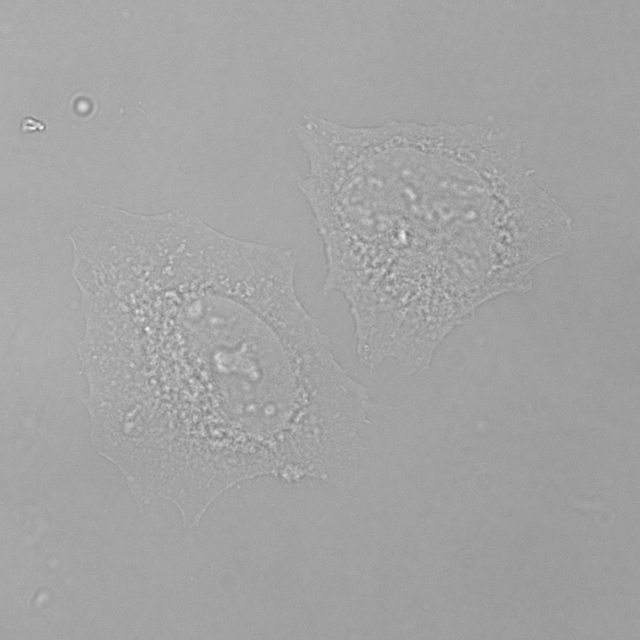
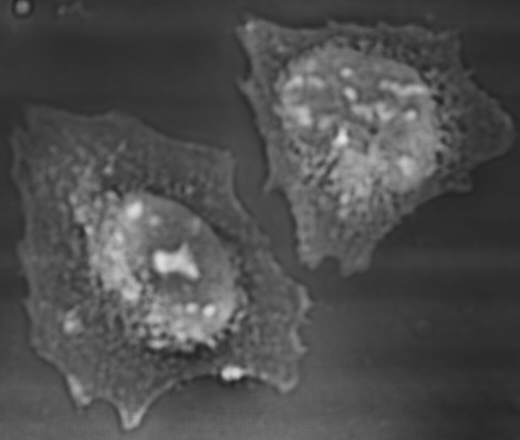
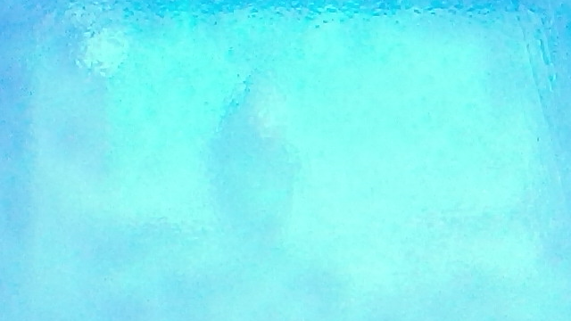
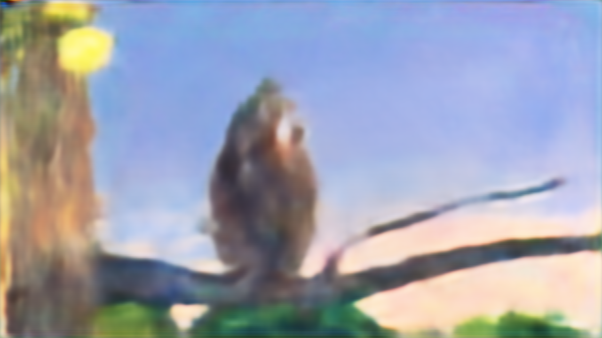
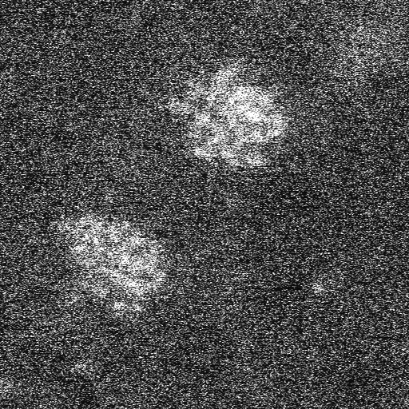
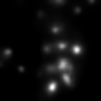
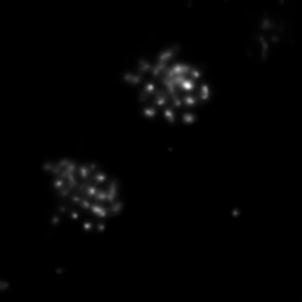

# MCNN-DEMO

Demonstration of multi-scale convolutional neural networks. Pre-print version at arxiv: <https://arxiv.org/abs/1810.12183>

----


### clone this repo

```bash
git clone https://github.com/fengwang/mcnn-demo.git
```

### Download pretrained models and raw-data

Download pretrained models and experimental dataset from `https://drive.google.com/drive/folders/1o5V6QJ3IbAkxwZknBI9HUL6OyUeMh2uH?usp=sharing`, and place all the files under folder `./data`

### Dependencies
+ `keras`
+ `numpy`
+ `scikit-image`
+ `scipy`
+ `tifffile`
+ `imageio`
+ `Jupyter`

### Tutorial

This is a little tutorial showing how to reconstruct phase from its Laplacian using MCNN. If you want to try MCNN in your own inverse problem, you are suggested to start from here.

```bash
cd ./demo
jupyter notebook
```

the select notebook `tutorial.ipynb`


## Phase retrieval from 32 de-focused images

```bash
cd ./demo/phase_retrieval/
python3 ./make_phase_retrieval.py
```

This will predict the phase and amplititude from 32 experimental defocused images, and the result will be saved to folder `./data/`.

The first defocused image



The predicted phase



The predicted amplitude


### Imaging objects from diffuse reflection

```bash
cd ./demo/diffuse_reconstruction
python3 ./make_diffuse_reconstruction.py
```

This will predict the objects from diffuse reflection images. The result will be stored to folder `./data/diffuse_reconstruction_outputs`.

The first diffuse image



The first predicted image




### Denoising HAADF STEM images

```bash
cd ./demo/denoising/
python3 ./make_denoising.py
```

This will predict the clear atomic STEM images from two experimental tiff images. One is taken with a resolution `512x512` at 15 fps, and the other one is `128x128` at 150 fps.


Examples of the noisy experimental images




and their corresponding clear output



### Citation

We kindly ask you to cite our publication if you use our dataset, code or models in your work.

```
@article{wangMultiresolutionConvolutionalNeural2020,
  title = {Multi-Resolution Convolutional Neural Networks for Inverse Problems},
  author = {Wang, Feng and Eljarrat, Alberto and Müller, Johannes and Henninen, Trond R. and Erni, Rolf and Koch, Christoph T.},
  date = {2020-03-31},
  journaltitle = {Scientific Reports},
  volume = {10},
  pages = {1--11},
  issn = {2045-2322},
  doi = {10.1038/s41598-020-62484-z},
  url = {https://www.nature.com/articles/s41598-020-62484-z},
  urldate = {2020-04-01},
  langid = {english},
  number = {1}
}
```


### License

GNU AGPLv3

