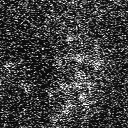

# MCNN-DEMO

Demonstration of multi-scale convolutional neural networks. Pre-print version at arxiv: <https://arxiv.org/abs/1810.12183>

----


### clone this repo

```bash
git clone https://github.com/fengwang/mcnn-demo.git
```

### Download pretrained models and raw-data


## Phase retrieval from 32 de-focused images

```bash
cd ./demo/phase_retrieval/
python3 ./make_phase_retrieval.py
```

This will predict the phase and amplititude from 32 experimental defocused images, and the result will be saved to folder `./data/`.

The first defocused image


The predicted phase


The predicted amplitude


### Imaging objects from diffuse reflection

```bash
cd ./demo/diffuse_reconstruction
python3 ./make_diffuse_reconstruction.py
```

This will predict the objects from diffuse reflection images. The result will be stored to folder `./data/diffuse_reconstruction_outputs`.

The first diffuse image


The first predicted image


### Denoising HAADF STEM images

```bash
cd ./demo/denoising/
python3 ./make_denoising.py
```

This will predict the clear atomic STEM images from two experimental tiff images. One is taken with a resolution `512x512` at 15 fps, and the other one is `128x128` at 150 fps.


Examples of the noisy experimental images




and their corresponding clear output


### License

GNU AGPLv3

